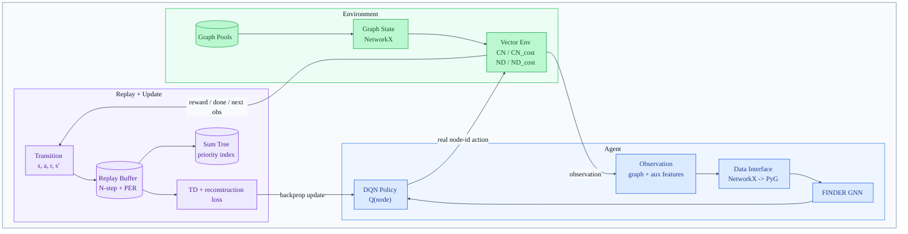

<div align="center">

# FINDER_Python

<p>
  <b>A Python · PyTorch · PyTorch Geometric reimplementation of <a href="https://www.nature.com/articles/s42256-020-0177-2">FINDER</a></b><br/>
  Unified DQN training for Critical Node &amp; Network Dismantling problems
</p>

<p>
  <a href="https://www.python.org/"></a>
  <a href="https://pytorch.org/"></a>
  <a href="https://pytorch-geometric.readthedocs.io/"></a>
  <a href="https://gymnasium.farama.org/"></a>
  <a href="https://docs.astral.sh/uv/"></a>
  <a href="LICENSE"></a>
</p>

<p>
  <b>English</b> &nbsp;·&nbsp;
  <a href="README_ZH.md">中文</a> &nbsp;·&nbsp;
  <a href="https://www.nature.com/articles/s42256-020-0177-2">Paper</a> &nbsp;·&nbsp;
  <a href="https://github.com/FFrankyy/FINDER">Original Code</a>
</p>


</div>

---

> **TL;DR** — A pure-Python, PyTorch-first reimplementation of FINDER. One CLI and one trainer drive four key-player variants (`cn`, `cn_cost`, `nd`, `nd_cost`) on Gymnasium-compatible NetworkX environments, with PyG batches that preserve real node IDs, JSON configs + CLI overrides, TensorBoard, checkpointing, and modern DQN tricks — no Cython build step required.

This repository follows the original FINDER paper, *"Finding key players in complex networks through deep reinforcement learning"* (Fan et al., *Nature Machine Intelligence*, 2020), and uses the paper's original open-source code, [FFrankyy/FINDER](https://github.com/FFrankyy/FINDER), as the methodological reference for the four problem settings. The goal is to provide a readable, Python-first PyTorch implementation for paper-style FINDER experiments and practical extensions.

## Contents

- [Why This Project](#why-this-project)
- [Project Structure](#project-structure)
- [Project Architecture](#project-architecture)
- [Problem Variants](#problem-variants)
- [Installation](#installation)
- [How to Train](#how-to-train)
- [TensorBoard](#tensorboard)
- [Configuration Files](#configuration-files)
- [Runtime Notes](#runtime-notes)
- [Key Modules](#key-modules)
- [Paper And Original Code Alignment](#paper-and-original-code-alignment)
- [Citation](#citation)
- [License](#license)

---

## Why This Project

FINDER targets a broad class of **key-player problems** in complex networks: choose nodes whose removal or activation strongly changes network connectivity. These problems appear in network robustness, epidemic control, drug-target discovery, infrastructure protection, and viral marketing, but are generally hard to solve exactly at scale.

We completely rewrote FINDER with Python, PyTorch, and PyTorch Geometric, with **practical experimentation as the main design goal**:

|     | Highlight |
| --- | --- |
| **No Cython build step**    | Environments, graph processing, training, and CLI are implemented in Python. |
| **Four variants, one entry**| Unified `cn`, `cn_cost`, `nd`, `nd_cost` through a single CLI and trainer.   |
| **Gymnasium envs**          | NetworkX-backed states ready for `SyncVectorEnv` / `AsyncVectorEnv`.         |
| **Real node-IDs preserved** | PyG `Data` interfaces keep the mapping between local indices and original IDs.|
| **Config + CLI overrides**  | JSON presets in `configs/` overridable from the command line.                |
| **Modern DQN tricks**       | Double DQN, Dueling DQN, Huber loss, N-step replay, prioritized replay.      |
| **Experiment-friendly**     | TensorBoard logging, checkpointing, best-model saving, deterministic seeding, gradient clipping. |

## Project Structure

```text
.
├── configs/        # CN / CN_cost / ND / ND_cost experiment configs
├── envs/           # Pure-Python FINDER graph environments and Gymnasium vector adapters
├── models/         # FINDER GNN, DQN policy networks, NetworkX -> PyG interfaces
├── trainers/       # Vectorized trainer, config system, replay buffers, logging utilities
├── train.py        # Main training entry point
├── requirements.txt
├── README.md       # English documentation
└── README_ZH.md    # Chinese documentation
```

## Project Architecture



The diagram highlights the RL loop: the environment emits NetworkX graph observations, the agent converts them to PyG batches and selects real node-id actions, the environment returns reward / done / next observation, transitions enter replay memory, and the trainer samples replay data to update the DQN policy.

| Role                                 | Main modules |
| ---                                  | --- |
| Entry and configuration              | `train.py`, `configs/*.json`, `trainers/config.py` |
| Environment                          | `envs/base_env.py`, `envs/cn_env.py`, `envs/cn_cost_env.py`, `envs/nd_env.py`, `envs/nd_cost_env.py`, `envs/gym_batch.py`, `envs/graph_pool.py` |
| Agent / model                        | `models/data_interfaces.py`, `models/gnn_arch.py`, `models/policy_net.py` |
| Replay and optimization              | `trainers/replay_buffer.py`, `trainers/sum_tree.py` |
| Training orchestration and artifacts | `trainers/vector_trainer.py`, `trainers/utils.py`, `experiments/<name>/` |

## Problem Variants

| Variant     | Problem                          | Objective |
| ---         | ---                              | --- |
| `cn`        | Critical Node                    | Remove nodes to minimize the connected-component decomposition score. |
| `cn_cost`   | Critical Node with cost          | Optimize connectivity damage while accounting for node removal costs. |
| `nd`        | Network Dismantling              | Remove nodes to reduce the largest connected component. |
| `nd_cost`   | Network Dismantling with cost    | Dismantle the graph with cost-aware node-removal rewards. |

> All environments return **dictionary observations** containing a NetworkX graph and auxiliary features. Actions are **real node labels** in the current NetworkX graph, and [models/data_interfaces.py](models/data_interfaces.py) keeps the mapping between PyG local indices and original node IDs.

## Installation

Use [`uv`](https://docs.astral.sh/uv/) for environment creation and dependency installation. **Python 3.12** is recommended.

```bash
# 1. Create the virtual environment
uv venv --python 3.12

# 2. Install PyTorch (CUDA 12.8 build, tested on Windows)
uv pip install torch==2.11.0 torchvision==0.26.0 torchaudio==2.11.0 \
  --default-index https://download.pytorch.org/whl/cu128

# 3. Install project dependencies
uv pip install -r requirements.txt

# 4. Install PyG compiled extensions matching torch 2.11.0 + CUDA 12.8
uv pip install pyg_lib torch_scatter torch_sparse \
  -f https://data.pyg.org/whl/torch-2.11.0+cu128.html
```

> **Wheel compatibility** — The CUDA wheel choice follows the official PyTorch install selector and the PyG wheel matrix. On Linux with matching PyG wheels, you can replace `cu128` with another official CUDA wheel suffix such as `cu130`; keep the PyTorch wheel URL and the PyG `data.pyg.org` URL on the same `torch + CUDA` combination.

## How to Train

Training starts from one of the JSON presets in `configs/`, then applies CLI overrides.

**Train the default Critical Node variant:**

```bash
uv run python train.py --variant cn
```

**Train the full CN setup with Double DQN, Dueling DQN, PER, Huber loss, and N-step learning:**

```bash
uv run python train.py --variant cn --full-tricks
```

**Run a named experiment on a selected GPU:**

```bash
uv run python train.py \
  --variant cn \
  --full-tricks \
  --seed 123 \
  --cuda-device 0 \
  --base-dir ./experiments \
  --experiment-name cn_full_seed123
```

**Run a short synchronized smoke test:**

```bash
uv run python train.py --variant nd --max-iterations 1000 --num-envs 2 --sync-env --no-eval
```

<details>
<summary><b>Common CLI options</b> (click to expand)</summary>

| Option                              | Example                                                              | Meaning |
| ---                                 | ---                                                                  | --- |
| `--variant`                         | `cn`, `cn_cost`, `nd`, `nd_cost`                                     | Selects the problem variant and its default config. |
| `--full-tricks`                     | `--variant cn --full-tricks`                                         | Uses `configs/cn_full_config.json`; currently applies to CN only. |
| `--seed`                            | `--seed 123`                                                         | Sets the global seed before vector environments are constructed. |
| `--device` / `--cuda-device`        | `--device cpu`, `--cuda-device 1`                                    | Selects CPU, default CUDA, or a specific GPU. |
| `--base-dir` / `--experiment-name`  | `--base-dir ./experiments --experiment-name cn_seed123`              | Controls where logs and model checkpoints are written. |
| `--max-iterations`                  | `--max-iterations 100000`                                            | Overrides the total number of training iterations. |
| `--batch-size`                      | `--batch-size 64`                                                    | Overrides the replay batch size. |
| `--learning-rate`                   | `--learning-rate 1e-4`                                               | Overrides the optimizer learning rate. |
| `--num-envs` / `--sync-env`         | `--num-envs 2 --sync-env`                                            | Controls vectorized environment count and sync / async execution. |
| `--eval-freq` / `--save-freq`       | `--eval-freq 5000 --save-freq 5000`                                  | Sets evaluation and checkpoint intervals. |
| `--eval-episodes` / `--eval-envs`   | `--eval-episodes 20 --eval-envs 4`                                   | Controls training-time evaluation workload. |
| `--no-eval`                         | `--no-eval`                                                          | Disables training-time evaluation for faster debugging. |
| `--max-grad-norm`                   | `--max-grad-norm 1.0`                                                | Enables gradient clipping at the given norm. |

</details>

## TensorBoard

Training writes TensorBoard event files to each experiment's `logs` directory. For example, the command below writes logs to `./experiments/cn_full_seed123/logs`:

```bash
uv run python train.py \
  --variant cn \
  --full-tricks \
  --base-dir ./experiments \
  --experiment-name cn_full_seed123
```

Start TensorBoard for all experiments:

```bash
uv run tensorboard --logdir ./experiments
```

Or inspect one experiment directly:

```bash
uv run tensorboard --logdir ./experiments/cn_full_seed123/logs
```

Then open <http://localhost:6006> in your browser.

## Configuration Files

Default experiment presets are stored in `configs/`. See [configs/README.md](configs/README.md) for the full field reference and CLI override mapping.

| File                              | Purpose                                                  |
| ---                               | ---                                                      |
| `configs/cn_config.json`          | Critical Node baseline.                                  |
| `configs/cn_cost_config.json`     | Critical Node with node removal costs.                   |
| `configs/nd_config.json`          | Network Dismantling baseline.                            |
| `configs/nd_cost_config.json`     | Network Dismantling with node removal costs.             |
| `configs/cn_full_config.json`     | CN with Double + Dueling DQN, PER, Huber, N-step.        |
| `configs/finder_defaults.json`    | Shared defaults inherited by all variants.               |

## Runtime Notes

> **Linux + CUDA + `AsyncVectorEnv`** — multiprocessing `spawn` must be configured before constructing `FinderVectorTrainer`. [`train.py`](train.py) handles this through `_setup_determinism_and_spawn(seed=...)`:
>
> - sets `multiprocessing.set_start_method("spawn", force=True)` on Linux
> - seeds `random`, `numpy`, `torch`, and `torch.cuda`
> - sets `FINDER_SEED`
> - disables TF32
> - fixes CUDNN deterministic behavior
> - configures thread-related environment variables

Gradient clipping defaults to `5.0` and can be overridden through config, CLI, or environment variable:

```bash
FINDER_MAX_GRAD_NORM=1.0 uv run python train.py
```

Vector environment seeding can also be set directly:

```bash
FINDER_SEED=123 uv run python train.py
```

## Key Modules

| Module | Responsibility |
| --- | --- |
| [envs/base_env.py](envs/base_env.py)               | Shared graph-environment logic, metrics, rewards, and action helpers. |
| [envs/gym_batch.py](envs/gym_batch.py)             | Gymnasium vector adapter that keeps raw dict observations.            |
| [models/gnn_arch.py](models/gnn_arch.py)           | FINDER GNN and reconstruction-aware loss.                             |
| [models/policy_net.py](models/policy_net.py)       | DQN / Double DQN / Dueling DQN policy networks.                       |
| [models/data_interfaces.py](models/data_interfaces.py) | NetworkX observations to PyG `Data` / graph batches.              |
| [trainers/replay_buffer.py](trainers/replay_buffer.py) | N-step replay buffer and prioritized replay.                      |
| [trainers/vector_trainer.py](trainers/vector_trainer.py) | Parallel sampling, optimization, evaluation, checkpointing, and cleanup. |
| [trainers/config.py](trainers/config.py)           | Variant-specific config loading and presets.                          |

## Paper And Original Code Alignment

| Original FINDER paper / code | This repository |
| --- | --- |
| Learn node-selection policies for key-player problems with deep reinforcement learning. | Implements DQN-style policies with a FINDER GNN backbone in PyTorch and PyG. |
| The original code organizes the four paper cases as CN, CN_cost, ND, and ND_cost.       | Provides `cn`, `cn_cost`, `nd`, and `nd_cost` through one CLI and shared trainer. |
| Use graph structure and auxiliary state features to score candidate nodes.              | Converts NetworkX observations into PyG batches while preserving real node IDs. |
| Evaluate learned policies through iterative node removal.                               | Supplies Gymnasium-compatible environments with single and vectorized sampling. |
| The original release is a TensorFlow implementation tied to the original reproduction scripts. | Reimplements the training stack around PyTorch, PyG, Gymnasium, JSON configs, CLI overrides, TensorBoard logs, checkpoints, and best-model saving. |

## Citation

If this repository helps your research, please cite this implementation **and** the original FINDER paper.

<details>
<summary><b>BibTeX — this repository</b></summary>

```bibtex
@software{finder_python,
  title  = {FINDER_Python: A Python, PyTorch, and PyG Reimplementation of FINDER},
  author = {superheroYu},
  year   = {2026},
  url    = {https://github.com/superheroYu/FINDER_Python},
  note   = {Python/PyTorch/PyG reimplementation of FINDER for Critical Node and Network Dismantling experiments}
}
```

</details>

<details>
<summary><b>BibTeX — original FINDER paper</b></summary>

```bibtex
@article{fan2020finding,
  title     = {Finding key players in complex networks through deep reinforcement learning},
  author    = {Fan, Changjun and Zeng, Li and Sun, Yizhou and Liu, Yang-Yu},
  journal   = {Nature Machine Intelligence},
  volume    = {2},
  pages     = {317--324},
  year      = {2020},
  publisher = {Nature Publishing Group},
  doi       = {10.1038/s42256-020-0177-2}
}
```

</details>

**Useful links**

- FINDER paper — <https://www.nature.com/articles/s42256-020-0177-2>
- Original FINDER code — <https://github.com/FFrankyy/FINDER>

## License

This project is licensed under the [MIT License](LICENSE).

---

<div align="center">
<sub>Made with PyTorch · PyTorch Geometric · NetworkX · Gymnasium</sub>
</div>
