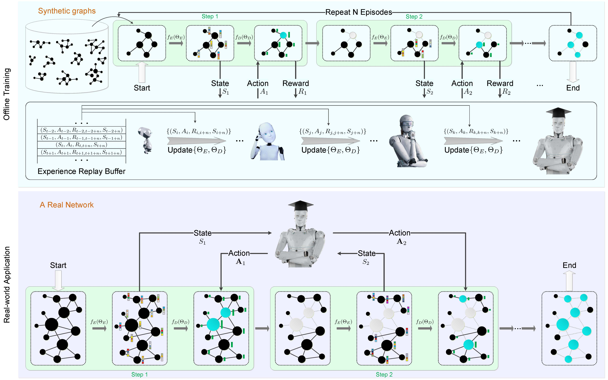
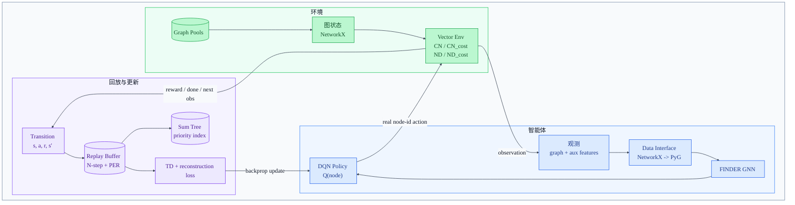

# FINDER_Python

[English](README.md) | 中文

基于 PyTorch、PyTorch Geometric、NetworkX 与 Gymnasium 的 FINDER 纯 Python 训练基础设施。本项目面向 Critical Node 和 Network Dismantling 两类图优化问题，提供 DQN 系列训练管线，并统一支持带成本与不带成本的四个 FINDER 变体。

本仓库延续原始 FINDER 论文 “Finding key players in complex networks through deep reinforcement learning”（Fan 等，Nature Machine Intelligence，2020）的研究方向，并以论文原始开源代码 [FFrankyy/FINDER](https://github.com/FFrankyy/FINDER) 作为四类问题设定的方法参照。项目目标是提供一套可读、易运行、便于扩展的 Python 优先 PyTorch 实现，用于论文思路复现和后续实验拓展。



## 项目定位

FINDER 关注复杂网络中的关键节点选择问题：找到一组节点，使得移除或激活它们后，网络连通性、鲁棒性或传播能力发生最大变化。这类问题可用于网络免疫、流行病控制、药物靶点发现、基础设施防护和传播营销等场景，但通常具有较高的组合优化复杂度。

我们使用 Python、PyTorch 和 PyTorch Geometric 对 FINDER 进行了完整重写，并围绕实际实验体验做了工程化增强：

- 纯 Python 主路径：环境、图处理、训练入口和配置系统都不需要 Cython 编译步骤。
- 四个变体统一入口：`cn`、`cn_cost`、`nd`、`nd_cost` 使用同一套 CLI、trainer 和配置对象。
- Gymnasium 兼容环境：单环境与向量环境都保留原始 NetworkX 图观测，便于调试与扩展。
- PyTorch Geometric 图批处理：从 NetworkX 到 PyG 的数据接口保留真实节点 ID 映射。
- 并行采样训练：支持 `SyncVectorEnv` 与 `AsyncVectorEnv`，可通过参数切换。
- 现代 DQN 技巧可配置：支持 N-step replay、PER、Double DQN、Dueling DQN、Huber loss。
- 实验工程完整：JSON 配置、命令行覆盖、TensorBoard 日志、checkpoint、best model、seed 与梯度裁剪都已集成。

## 项目结构

```text
.
├── configs/        # CN / CN_cost / ND / ND_cost 实验配置
├── envs/           # 纯 Python FINDER 图环境与 Gymnasium 向量环境适配器
├── models/         # FINDER GNN、DQN 策略网络、NetworkX -> PyG 数据接口
├── trainers/       # 向量化训练器、配置系统、replay buffer、日志与 checkpoint 工具
├── train.py        # 主训练入口
├── requirements.txt
├── README.md       # 英文说明文档
└── README_ZH.md    # 中文说明文档
```

## 项目架构



这张图强调 RL 闭环：环境返回 NetworkX 图观测，智能体将观测转换为 PyG 批数据并输出节点动作，环境执行动作后产生 reward / done / next observation，transition 进入 replay buffer，训练器再采样更新 DQN policy。

| 职责 | 主要模块 |
| --- | --- |
| 入口与配置 | `train.py`、`configs/*.json`、`trainers/config.py` |
| 环境 | `envs/base_env.py`、`envs/cn_env.py`、`envs/cn_cost_env.py`、`envs/nd_env.py`、`envs/nd_cost_env.py`、`envs/gym_batch.py`、`envs/graph_pool.py` |
| 智能体 / 模型 | `models/data_interfaces.py`、`models/gnn_arch.py`、`models/policy_net.py` |
| 回放与优化 | `trainers/replay_buffer.py`、`trainers/sum_tree.py` |
| 训练编排与实验产物 | `trainers/vector_trainer.py`、`trainers/utils.py`、`experiments/<name>/` |

## 问题变体

| 变体 | 问题 | 优化目标 |
| --- | --- | --- |
| `cn` | Critical Node | 移除节点，使连通分量分解得分尽可能低。 |
| `cn_cost` | 带成本的 Critical Node | 在考虑节点移除成本的同时破坏网络连通性。 |
| `nd` | Network Dismantling | 移除节点，使最大连通分量尽可能小。 |
| `nd_cost` | 带成本的 Network Dismantling | 通过 cost-aware 节点移除奖励拆解网络。 |

所有环境统一返回包含 NetworkX 图与辅助特征的 dict 观测；动作语义是当前 NetworkX 图中的真实节点标签。`models/data_interfaces.py` 会维护 PyG 局部索引与真实节点 ID 的映射，避免训练和环境交互时节点编号错位。

## 环境准备

本项目使用 `uv` 创建环境和安装依赖。建议使用 Python 3.12。

```bash
uv venv --python 3.12

# 当前 Windows 测试环境使用：
# PyTorch 2.11.0 + CUDA 12.8 wheels。
uv pip install torch==2.11.0 torchvision==0.26.0 torchaudio==2.11.0 --default-index https://download.pytorch.org/whl/cu128

uv pip install -r requirements.txt

# 与 torch 2.11.0 + CUDA 12.8 匹配的 PyG 编译扩展。
uv pip install pyg_lib torch_scatter torch_sparse -f https://data.pyg.org/whl/torch-2.11.0+cu128.html
```

CUDA wheel 的选择依据 PyTorch 官方安装选择器和 PyG wheel 矩阵。Linux 环境且 PyG 已提供对应 wheel 时，可以把 `cu128` 换成 `cu130` 等官方 CUDA 后缀；需要保持 PyTorch wheel URL 与 PyG `data.pyg.org` URL 的 `torch + CUDA` 组合一致。

## 如何训练

训练会先读取 `configs/` 中对应变体的 JSON 预设，再应用命令行覆盖项。

训练默认 Critical Node 变体：

```bash
uv run python train.py --variant cn
```

使用完整 CN 配置训练，启用 Double DQN、Dueling DQN、PER、Huber loss 和 N-step learning：

```bash
uv run python train.py --variant cn --full-tricks
```

指定实验名、随机种子和 GPU：

```bash
uv run python train.py \
  --variant cn \
  --full-tricks \
  --seed 123 \
  --cuda-device 0 \
  --base-dir ./experiments \
  --experiment-name cn_full_seed123
```

运行短程同步 smoke test：

```bash
uv run python train.py --variant nd --max-iterations 1000 --num-envs 2 --sync-env --no-eval
```

常用命令行参数：

| 参数 | 示例 | 含义 |
| --- | --- | --- |
| `--variant` | `cn`、`cn_cost`、`nd`、`nd_cost` | 选择问题变体及其默认配置。 |
| `--full-tricks` | `--variant cn --full-tricks` | 使用 `configs/cn_full_config.json`；当前仅适用于 CN。 |
| `--seed` | `--seed 123` | 在创建向量化环境前设置全局随机种子。 |
| `--device` / `--cuda-device` | `--device cpu`、`--cuda-device 1` | 选择 CPU、默认 CUDA 或指定 GPU。 |
| `--base-dir` / `--experiment-name` | `--base-dir ./experiments --experiment-name cn_seed123` | 控制日志和模型 checkpoint 的输出目录。 |
| `--max-iterations` | `--max-iterations 100000` | 覆盖训练总迭代次数。 |
| `--batch-size` | `--batch-size 64` | 覆盖 replay batch size。 |
| `--learning-rate` | `--learning-rate 1e-4` | 覆盖优化器学习率。 |
| `--num-envs` / `--sync-env` | `--num-envs 2 --sync-env` | 控制向量化环境数量和同步 / 异步执行方式。 |
| `--eval-freq` / `--save-freq` | `--eval-freq 5000 --save-freq 5000` | 设置评估和 checkpoint 保存间隔。 |
| `--eval-episodes` / `--eval-envs` | `--eval-episodes 20 --eval-envs 4` | 控制训练期间评估的 episode 数和并行环境数。 |
| `--no-eval` | `--no-eval` | 关闭训练期间评估，便于快速调试。 |
| `--max-grad-norm` | `--max-grad-norm 1.0` | 按给定范数进行梯度裁剪。 |

## TensorBoard

训练会把 TensorBoard event 文件写入每个实验目录下的 `logs`。例如下面的命令会写入 `./experiments/cn_full_seed123/logs`：

```bash
uv run python train.py \
  --variant cn \
  --full-tricks \
  --base-dir ./experiments \
  --experiment-name cn_full_seed123
```

查看所有实验：

```bash
uv run tensorboard --logdir ./experiments
```

只查看某一个实验：

```bash
uv run tensorboard --logdir ./experiments/cn_full_seed123/logs
```

然后在浏览器打开 <http://localhost:6006>。

## 配置文件

默认实验预设位于 `configs/`。完整字段含义和命令行覆盖关系见 [configs/README_ZH.md](configs/README_ZH.md)。

- `configs/cn_config.json`
- `configs/cn_cost_config.json`
- `configs/nd_config.json`
- `configs/nd_cost_config.json`
- `configs/cn_full_config.json`
- `configs/finder_defaults.json`

## 重要运行说明

在 Linux + CUDA + `AsyncVectorEnv` 场景下，需要在构造 `FinderVectorTrainer` 前设置 multiprocessing `spawn`。当前 [train.py](train.py) 已通过 `_setup_determinism_and_spawn(seed=...)` 统一处理：

- 在 Linux 上设置 `multiprocessing.set_start_method("spawn", force=True)`
- 固定 `random`、`numpy`、`torch`、`torch.cuda` seed
- 设置 `FINDER_SEED`
- 禁用 TF32
- 固定 CUDNN deterministic 行为
- 设置线程相关环境变量

梯度裁剪阈值默认为 `5.0`，可通过配置、命令行或环境变量覆盖：

```bash
FINDER_MAX_GRAD_NORM=1.0 uv run python train.py
```

向量环境 seed 也可以直接通过环境变量设置：

```bash
FINDER_SEED=123 uv run python train.py
```

## 关键模块

- [envs/base_env.py](envs/base_env.py)：图环境通用逻辑、指标、奖励与动作辅助方法。
- [envs/gym_batch.py](envs/gym_batch.py)：保留 dict 观测的 Gymnasium 向量环境适配器。
- [models/gnn_arch.py](models/gnn_arch.py)：FINDER GNN 与包含图重构项的 loss。
- [models/policy_net.py](models/policy_net.py)：DQN / Double DQN / Dueling DQN 策略网络。
- [models/data_interfaces.py](models/data_interfaces.py)：NetworkX 观测转 PyG `Data` 与图批数据。
- [trainers/replay_buffer.py](trainers/replay_buffer.py)：N-step replay buffer 与 prioritized replay。
- [trainers/vector_trainer.py](trainers/vector_trainer.py)：并行采样、优化、评估、checkpoint 与资源清理。
- [trainers/config.py](trainers/config.py)：变体配置加载与预设管理。

## 与论文及原始代码的对应关系

| FINDER 原始论文/代码 | 本项目实现 |
| --- | --- |
| 用深度强化学习学习复杂网络中的关键节点选择策略。 | 基于 PyTorch 与 PyG 实现 DQN 系列策略网络和 FINDER GNN。 |
| 原始代码按论文四类任务组织为 CN、CN_cost、ND、ND_cost。 | 通过同一 CLI 和 trainer 支持 `cn`、`cn_cost`、`nd`、`nd_cost` 四个变体。 |
| 结合图结构与辅助状态特征，对候选节点进行打分。 | 将 NetworkX 观测转换为 PyG 批数据，并保留真实节点 ID 映射。 |
| 通过迭代移除节点评估策略效果。 | 提供 Gymnasium 兼容的单环境与向量环境，支持并行采样。 |
| 原始发布版本是面向论文复现实验的 TensorFlow 实现。 | 使用 PyTorch、PyG、Gymnasium、JSON 配置、CLI 覆盖、TensorBoard、checkpoint 和 best model 重新实现训练栈。 |

## 引用

如果本项目对你的研究有帮助，请同时引用本仓库实现和原始 FINDER 论文。

```bibtex
@software{finder_python,
  title = {FINDER_Python: A Python, PyTorch, and PyG Reimplementation of FINDER},
  author = {superheroYu},
  year = {2026},
  url = {https://github.com/superheroYu/FINDER_Python},
  note = {Python/PyTorch/PyG reimplementation of FINDER for Critical Node and Network Dismantling experiments}
}
```

原始 FINDER 论文：

```bibtex
@article{fan2020finding,
  title={Finding key players in complex networks through deep reinforcement learning},
  author={Fan, Changjun and Zeng, Li and Sun, Yizhou and Liu, Yang-Yu},
  journal={Nature Machine Intelligence},
  volume={2},
  pages={317--324},
  year={2020},
  publisher={Nature Publishing Group},
  doi={10.1038/s42256-020-0177-2}
}
```

相关链接：

- FINDER 论文：<https://www.nature.com/articles/s42256-020-0177-2>
- FINDER 原始开源代码：<https://github.com/FFrankyy/FINDER>

## 许可证

本项目采用 [MIT License](LICENSE) 开源。
