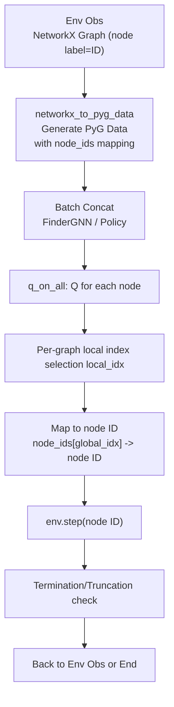
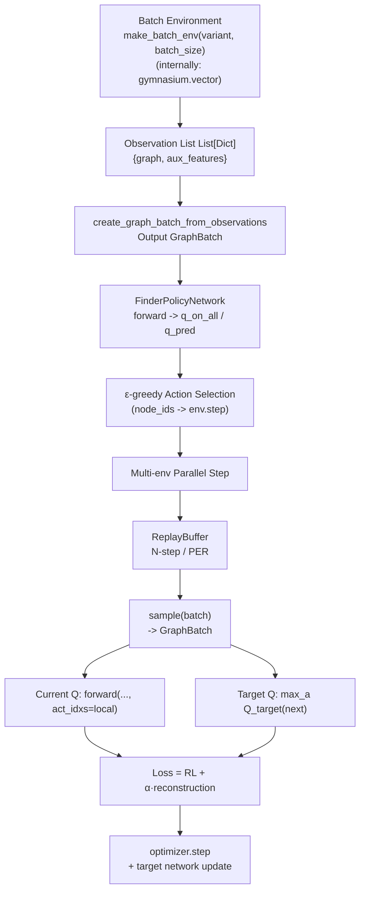

English | [中文](README_ZH.md)

# FINDER Training Infrastructure

Efficient training infrastructure for the FINDER deep reinforcement learning framework, built on Gymnasium's parallel vectorized environments. Supports four variants (CN, CN_cost, ND, ND_cost), N-step/prioritized replay, PyTorch + PyTorch Geometric GNN policy networks, and a unified config/logging/checkpoint system.

## Overview

This package provides a complete training pipeline including:
- Parallel environment sampling: batch environments + ε-greedy strategy
- Experience replay: standard N-step replay and optional prioritized replay (PER)
- Modular architecture: standardized interfaces between environments/models/trainer
- Monitoring and logging: training metrics, performance monitoring, TensorBoard, checkpoints
- Multi-variant support: CN, CN_cost, ND, ND_cost

## Architecture and Components

1. Configuration System (`config.py`)
   - Loads per-variant presets from `configs/{variant}_config.json`
   - Keeps `configs/finder_defaults.json` as a fallback/reference file
   - Supports programmatic presets (`fast_debug`/`production`) through `apply_config_preset`

2. Vectorized Trainer (`vector_trainer.py`)
   - Main training loop: parallel sampling, experience replay, loss computation, target network updates
   - Interfaces with FINDER batch environments and policy networks

3. Vector Environments (gymnasium.vector based, with auto-reset support)
   - Parallel environments created via `envs.gym_batch.make_gym_batch_env`; `envs.make_batch_env` delegates to the same adapter
   - Preserves observations as raw dictionaries (NetworkX graph + auxiliary features), no extra conversion
   - **Important**: Correctly handles the vector environment auto-reset mechanism; terminal states retrieved from `infos['final_observation']`

4. Experience Replay (`replay_buffer.py`)
   - N-step learning and PER (sum tree + importance sampling weights)

5. Data Interfaces (`models/data_interfaces.py`)
   - NetworkX observations → PyG Data/Batch → GraphBatch; preserves `node_ids` mapping

6. Utilities (`utils.py`)
   - Logging, performance monitoring, checkpointing, metrics analysis and reporting

## Programmatic Training

```python
from trainers import FinderVariant, FinderVectorTrainer, get_default_config

config = get_default_config(FinderVariant.CN)
config.training.max_iterations = 50000
config.vector_env.num_envs = 4
config.vector_env.async_env = False

trainer = FinderVectorTrainer(config)
try:
    results = trainer.train()
finally:
    trainer.cleanup()
```

## Variant Support

Four FINDER problem variants are supported:
- CN: Critical Node (without cost)
- CN_cost: Critical Node (with cost)
- ND: Network Dismantling (without cost)
- ND_cost: Network Dismantling (with cost)

Each variant has a primary preset in `configs/{variant}_config.json`; `configs/finder_defaults.json` is kept as a fallback/reference file.

## Integration Interfaces

### Environment Interface
Environment classes inherit from `BaseFINDEREnv` and implement problem-specific reward and termination logic. The trainer creates batch environments through `envs.make_batch_env` / `envs.gym_batch.make_gym_batch_env`, returning NetworkX observations as dictionaries.

### Model Interface
Policy networks use `FinderPolicyNetwork` (PyTorch+PyG). During training, GraphBatch is fed in; the main path outputs `q_on_all` for all nodes, and `q_pred` is selected based on per-graph local indices for supervision. During environment interaction, `node_ids` are used to map back to "node IDs".

## Configuration

### Presets
- `fast_debug`: Lightweight testing (small memory, few iterations)
- `production`: Full training (large memory, 500k iterations)

### Customization
For command-line training, edit the per-variant JSON files in `configs/` or use CLI overrides from `train.py`. For programmatic use, mutate the config object before constructing `FinderVectorTrainer`, or pass flat `config_overrides` keys to `create_trainer`.

## Training Features

- Parallel environment sampling; asynchronous or synchronous execution
- N-step learning; optional prioritized replay (PER)
- Double DQN / Huber Loss toggles
- Periodic target network updates, exploration rate scheduling
- TensorBoard logging, checkpointing, and best model saving

## Validation

```bash
uv run python -c "from trainers import FinderVariant, get_default_config; config = get_default_config(FinderVariant.CN); print(config.variant.value, config.training.max_iterations)"
uv run python train.py --help
```

## File Structure

```
trainers/
├── __init__.py
├── config.py
├── vector_trainer.py
├── replay_buffer.py
├── sum_tree.py
├── utils.py
├── README.md
└── README_ZH.md
```

## Dependencies

Requires: torch, torch_geometric, gymnasium, networkx, numpy, tensorboard, tqdm, matplotlib, seaborn, scipy, pandas, psutil.

## Flow Diagrams (paste into mermaid.live)

### Action Data Flow


### Training Data Flow


## Vector Environment Auto-Reset Mechanism

**Important**: This trainer correctly handles the `gymnasium.vector` auto-reset mechanism to ensure training data accuracy.

### Key Features
- When a sub-environment terminates, `gymnasium.vector` automatically resets the environment
- The returned `next_observations` are already the post-reset initial observation
- The true terminal state is stored in `infos['final_observation']`
- The trainer retrieves the correct terminal state from `final_observation` for experience replay

### Implementation Details
```python
# When environment terminates
if done_flag:
    if 'final_observation' in infos and infos['final_observation'] is not None:
        # Use the true terminal state as next_state
        terminal_next_obs = infos['final_observation'][env_id]
    else:
        # Fallback handling
        terminal_next_obs = obs

    # Add terminal experience to replay buffer
    replay_buffer.add_experience(
        state=obs,
        next_state=terminal_next_obs,  # correct terminal state
        done=True
    )
```

## Performance and Scaling

- Efficient graph batching and memory management; GPU acceleration throughout
- Easy to extend: custom environments/models/algorithms/evaluation metrics
- Compatible with original FINDER training dynamics and hyperparameter settings
- Correct handling of vector environment auto-reset mechanism, ensuring training data integrity

---

**Version**: 1.0.0  
**Status**: Ready for end-to-end FINDER training
