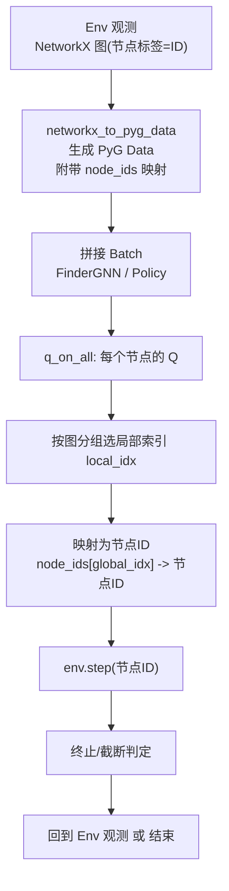
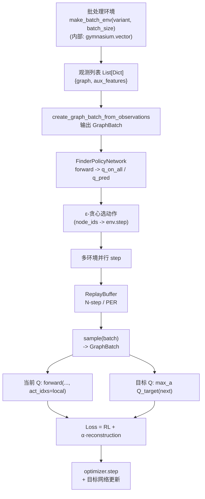

[English](README.md) | 中文

# FINDER 训练基础设施

面向FINDER深度强化学习框架的高效训练基础设施，基于Gymnasium的并行向量化环境构建，支持四大变体（CN、CN_cost、ND、ND_cost）、N步/优先级回放、PyTorch + PyTorch Geometric 的GNN策略网络，以及统一的配置/日志/检查点体系。

## 概述

本包提供完整的训练管线，包含：
- 并行环境采样：批处理环境 + ε-贪心策略
- 经验回放：标准N步回放与可选优先级回放（PER）
- 模块化架构：环境/模型/训练器之间的标准化接口
- 监控与日志：训练指标、性能监控、TensorBoard、检查点
- 多变体支持：CN、CN_cost、ND、ND_cost

## 架构与组件

1. 配置系统（`config.py`）
   - 从 `configs/{variant}_config.json` 加载各变体主预设
   - 保留 `configs/finder_defaults.json` 作为 fallback / 参考配置
   - 通过 `apply_config_preset` 支持程序化预设（`fast_debug`/`production`）

2. 向量化训练器（`vector_trainer.py`）
   - 主训练流程：并行采样、经验回放、损失计算、目标网络更新
   - 对接 FINDER 批处理环境与策略网络

3. 向量环境（基于 gymnasium.vector，支持自动重置）
   - 通过 `envs.gym_batch.make_gym_batch_env` 创建并行环境；`envs.make_batch_env` 会委托到同一个适配器
   - 保持观测为原始字典（NetworkX 图 + 辅助特征），不做额外转换
   - **重要**：正确处理向量环境自动重置机制，终局状态从 `infos['final_observation']` 获取

4. 经验回放（`replay_buffer.py`）
   - N步学习与PER（sum tree + 重要性采样权重）

5. 数据接口（`models/data_interfaces.py`）
   - NetworkX观测 → PyG Data/Batch → GraphBatch；保留 `node_ids` 映射

6. 工具（`utils.py`）
   - 日志、性能监控、检查点、指标分析与报告

## 程序化训练

```python
from trainers import FinderVariant, FinderVectorTrainer, get_default_config

config = get_default_config(FinderVariant.CN)
config.training.max_iterations = 50000
config.vector_env.num_envs = 4
config.vector_env.async_env = False

trainer = FinderVectorTrainer(config)
try:
    results = trainer.train()
finally:
    trainer.cleanup()
```

## 变体支持

支持四个FINDER问题变体：
- CN：关键节点（无成本）
- CN_cost：关键节点（有成本）
- ND：网络拆解（无成本）
- ND_cost：网络拆解（有成本）

各变体主配置位于 `configs/{variant}_config.json`；`configs/finder_defaults.json` 作为 fallback / reference 文件保留。

## 集成接口

### 环境接口
环境类继承 `BaseFINDEREnv`，并实现各问题对应的 reward 与 termination 逻辑。训练器通过 `envs.make_batch_env` / `envs.gym_batch.make_gym_batch_env` 创建批处理环境，返回 NetworkX dict 观测。

### 模型接口
策略网络采用`FinderPolicyNetwork`（PyTorch+PyG）；训练时以GraphBatch喂入，主路径对全节点输出`q_on_all`，基于每图局部索引选择`q_pred`进行监督；与环境交互时使用`node_ids`映射回“节点ID”。

## 配置

### 预设
- fast_debug：轻量测试（小内存、少迭代）
- production：完整训练（大内存、50万迭代）

### 自定义
命令行训练可修改 `configs/` 下的各变体 JSON，或使用 `train.py` 的 CLI 覆盖项。程序化使用时，可在构造 `FinderVectorTrainer` 前直接修改 config 对象，也可以向 `create_trainer` 传入扁平的 `config_overrides` 键。

## 训练特性

- 并行环境采样；异步或同步执行
- N步学习；可选优先级回放（PER）
- Double DQN/Huber Loss 开关
- 目标网络周期更新，探索率调度
- TensorBoard日志、检查点与最佳模型保存

## 验证

```bash
uv run python -c "from trainers import FinderVariant, get_default_config; config = get_default_config(FinderVariant.CN); print(config.variant.value, config.training.max_iterations)"
uv run python train.py --help
```

## 文件结构

```
trainers/
├── __init__.py
├── config.py
├── vector_trainer.py
├── replay_buffer.py
├── sum_tree.py
├── utils.py
├── README.md
└── README_ZH.md
```

## 依赖

需要：torch、torch_geometric、gymnasium、networkx、numpy、tensorboard、tqdm、matplotlib、seaborn、scipy、pandas、psutil。

## 流程图（可直接粘贴 mermaid.live）

### 动作数据流


### 训练数据流


## 向量环境自动重置机制

**重要**：本训练器正确处理了 `gymnasium.vector` 的自动重置机制，确保训练数据的准确性。

### 关键特性
- 当子环境终止时，`gymnasium.vector` 自动重置环境
- 返回的 `next_observations` 已经是重置后的初始观测
- 真正的终局状态存储在 `infos['final_observation']` 中
- 训练器从 `final_observation` 获取正确的终局状态用于经验回放

### 实现细节
```python
# 当环境终止时
if done_flag:
    if 'final_observation' in infos and infos['final_observation'] is not None:
        # 使用真正的终局状态作为 next_state
        terminal_next_obs = infos['final_observation'][env_id]
    else:
        # 回退处理
        terminal_next_obs = obs
    
    # 添加终局经验到回放缓冲区
    replay_buffer.add_experience(
        state=obs,
        next_state=terminal_next_obs,  # 正确的终局状态
        done=True
    )
```

## 性能与扩展

- 高效图批处理与内存管理；GPU加速贯穿
- 易于扩展：自定义环境/模型/算法/评估指标
- 兼容原始FINDER的训练动力学与超参设定
- 正确处理向量环境的自动重置机制，确保训练数据完整性

——

**版本**：1.0.0  
**状态**：可直接运行 FINDER 端到端训练
